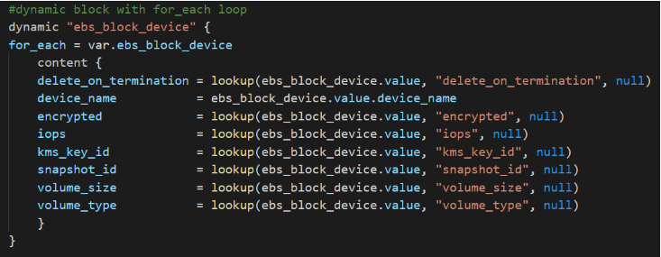

# Terraform

## Terraform is infrasturcutre automation.

## Terraform Object Types

1. Providers
2. Resources
3. Data Sources   (associated witht the providers)

## Terraform Object Rerference

<resource_type>.<object_name>.<attribute_name>

## Workflow

terraform init  --> terraform plan  --> terraform apply

## Terrfaomr CLI Commands


1. terraform init
2. terrafrom plan
3. terraform apply
    **replace -** If you untent to force replacement of a particular object evern though there are no configuraiton changes use -replaxe option with terraform apply.
    for Example: terraform apply -replace="aws_instance.example[0]"
4. terraform destroy
5. **terraform providers** - Used to find what provider name you are dpeloying
6. **terraform providers Schema**  - print detialed schema for the providers used in the current configuration.
7. **terraform taint** - Deprecated now in terrafornm version 0.15.2. and higher. The terraform taint command informs Terraform that a particular object has become degraded or damaged. Terraform represents this by marking the object as "tainted" in the Terraform state, and Terraform will propose to replace it in the next plan you create.
8. **terraform login [hostname]** - login into terraform enterprise. Saves the api token
9. **terraform logout** - logout from terraform cloud. Used to remove credentials stored by terraform login.

## Terrafrom state commands 

1. The **terraform state list**  command shows the resource addresses for every resource Terraform knows about in a configuration, optionally filtered by partial resource address.

2. The **terraform state show** command displays detailed state data about one resource.

3. The **terraform refresh** command updates state data to match the real-world condition of the managed resources. This is done automatically during plans and applies, but not when interacting with state directly.


## Variables and Outputs

variable "name_label" {}

variable "name_label" {
    type = value
    descritpion = "value"
    default = "value"
    sensitive = true | false
}

Example

variable "aws_region" {
    type = string"
    default - "us-wast-1"
}

### Value Reference

var.<name_label>

var.aws_region

### Terraform Datatypes


#### List Example


#### Map Example


#### Local Variables Example


### Supply Variable Values

1. Default Value
2. -var flag
3. -var-file flag
4. terraform.tfvars or terraform.tfvars.json
5. .auto.tfvars or .auto.tfvars.json
6. Environment variable TF_VAR_         


## Terraform Modules

Modules are a critical component of production-grade Terraform configurations. It gives infrastructure developers the ability to split infrastructure services up into separate components. For example, you can have a module for deploying EC2 Instances and a module for deploying VPCs. You can then use each module as a building block for creating entire environments in AWS.

Terraform modules are just snippets of code that can be called from within other Terraform configurations. Think of it as how functions are used from a software development perspective. Functions are used to isolate actions or processes in code, which allows them to be tested, decoupled, and reused throughout the application. In Terraform, the concept is still the same, but they are called modules. 


## Terraform Remote state

1. Terraform state is stored locally by default in a terraform.tfstate file. With remote state, Terraform writes to a state file hosted in a remote data store. 
2. This provides a few advantages over a local state file like security, version control, and centralized storage. It also provides state locking, which is where only one person can modify the state file at a time, which prevents teammates from writing over each other. 
3. In AWS you can use an S3 bucket for storing the state file and a DynamoDB table for state locking.
4. The backend block refers to how Terraform operates with the state file. By default, the local backend is used, but creating a backend block within the Terraform configuration block tells Terraform to use an S3 bucket to store the state file.


## Importing AWS Resources into Terraform

Importing existing infrastructure into Terraform is a slow process that must be done with caution. One of the key takeaways is to understand that importing infrastructure does not create a Terraform configuration automatically. The configuration must be created manually. The typical workflow for importing existing infrastructure into Terraform is as follows:


Existing infrastructure is imported using the terraform import command, then the Terraform configuration file is modified to sync with the existing infrastructure settings. Afterward, terraform plan and terraform apply are used to verify both the Terraform configuration, state, and existing resources are in sync. 

Terraform requires the ID of the resource to be imported. In this case, the VPC ID is required since a VPC is being imported. If a Subnet were to be imported, Terraform would require a Subnet ID.


```
**main.tf**
resource "aws_vpc" "dev" {}
```

```
VpcID=$(aws ec2 describe-vpcs --region us-west-2 --filters Name=tag:Name,Values='Web VPC' --output text --query "Vpcs[].VpcId") && echo $VpcID
//vpc-078251144ebb7a53b
terraform import aws_vpc.dev $VpcID
```


## Conditional Logic in Terraform Configurations


 


## Creating Loops in the Terraform Configuration and Scaling Resources

Dynamic blocks can be used for resources that contain repeatable configuration blocks. Instead of repeating several ebs_block_device blocks, a dynamic block is used to simplify the code. This is done by combining the dynamic block with a for_each loop inside. 



Count allows for creating multiple instances of a resource block. Almost all resource blocks can use the count attribute. It is simply the number of times to create the resource block. It can also be used as conditional logic. In this case, the value of count is a conditional expression. If var.associate_public_ip_address is true set the count value to 1, if false set it to 0. This allows resource blocks to be created conditionally. In this example, a public IP address is not created if var.associate_public_ip_address is set to false.


## Seninel - Policy as Code

### Benefits
1. Sandboxing
2. Codification
3. Version Control
4. Testing
5. Automation

Sentinel Policy is applied after Terraform Plan and Before Terraform Apply.


## Terraform Backends

Backends define where Terraform's state snapshots are stored.

### Enhanced
    Enhacned backends can both store state and perform operations. There are only 2 enhanced backends: local and remote.

### Standard
    Standard backends only store state and rely on local backend for performaing operations


## Terraform Provisioners

### local-exec provisioner

The local-exec provisioner invokes a local executable after a resource is created. This invokes a process on the machine running Terraform, not on the resource

```
resource "null_resource" "example1" {
  provisioner "local-exec" {
    command = "open WFH, '>completed.txt' and print WFH scalar localtime"
    interpreter = ["perl", "-e"]
  }
}
```

### remote-exec provisioner
The remote-exec provisioner invokes a script on a remote resource after it is created. This can be used to run a configuration management tool, bootstrap into a cluster, etc.
The remote-exec provisioner requires a connection and supports both ssh and winrm.
```
resource "aws_instance" "web" {
  # ...

  # Establishes connection to be used by all
  # generic remote provisioners (i.e. file/remote-exec)
  connection {
    type     = "ssh"
    user     = "root"
    password = var.root_password
    host     = self.public_ip
  }

  provisioner "remote-exec" {
    inline = [
      "puppet apply",
      "consul join ${aws_instance.web.private_ip}",
    ]
  }
}
```


